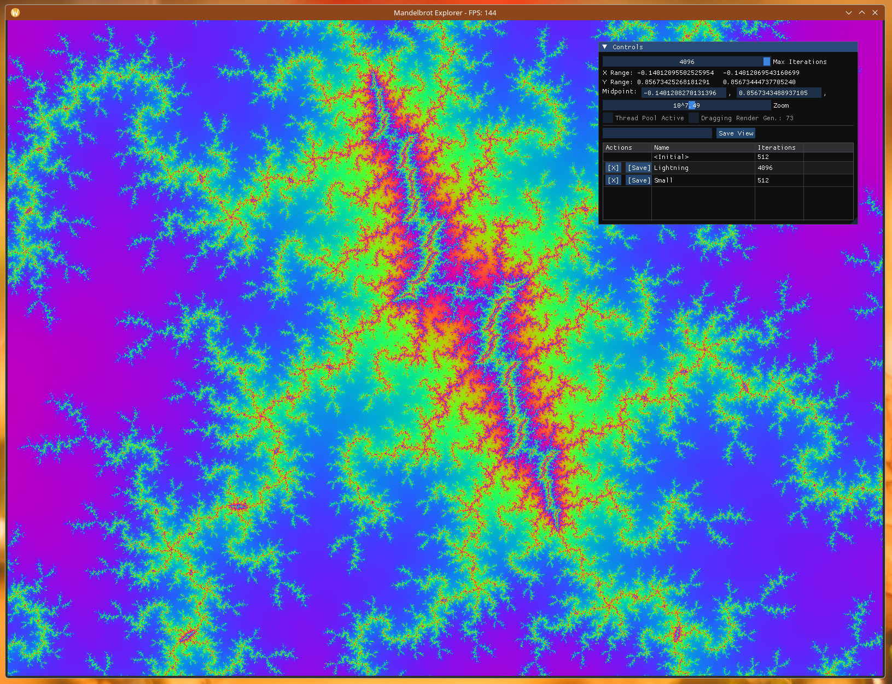

# Mandel

An interactive Mandelbrot fractal explorer built with Dear ImGui, SDL2, and OpenGL3.



Licensed under the [MIT License](LICENSE).

## Prerequisites

- CMake 3.15 or higher
- C++17 compatible compiler
- SDL2 development libraries
- OpenGL development libraries

### Installing dependencies on Linux (Fedora/Nobara)

```bash
sudo dnf install cmake gcc-c++ SDL2-devel mesa-libGL-devel
```

## Building

1. Configure the project:
```bash
cmake -B build -S . -DCMAKE_BUILD_TYPE=Debug
```

For static SDL2 linking (self-contained binary, no SDL2 runtime needed):
```bash
# Fedora/Nobara: install static SDL2
sudo dnf install SDL2-devel sdl2-compat-static

# Configure and build
cmake -B build -S . -DCMAKE_BUILD_TYPE=Release -DSTATIC_LINKING=ON
cmake --build build
```
If static SDL2 is not available, the build automatically falls back to dynamic linking.

2. Build:
```bash
cmake --build build
```

The executable will be in `build/` (or `build/Debug/`/`build/Release/` depending on your generator and build type).

### Static Linking Notes

- **SDL2**: Statically linked when available (e.g. `sdl2-compat-static` on Fedora), otherwise dynamic
- **OpenGL**: Dynamically linked for driver compatibility
- **ImGui**: Compiled from source, always statically linked

## ImGui Setup

The project will automatically fetch imgui using CMake's FetchContent if it's not found in `external/imgui/`. 

To use a local copy of imgui:
```bash
mkdir -p external
cd external
git clone https://github.com/ocornut/imgui.git
cd ..
```

## VS Code Debugging

Press **F5** to build and debug the project. The configuration files are in `.vscode/`:
- `launch.json` - Debug configuration
- `tasks.json` - Build tasks
- `settings.json` - CMake settings

## Project Structure

```
Mandel/
├── CMakeLists.txt       # CMake build configuration
├── src/                 # Source files (.cpp, .hpp)
├── external/            # External dependencies (optional)
├── build/               # Build directory (generated)
├── .vscode/             # VS Code configuration
├── LICENSE              # MIT License
└── Mandel-sample.png    # Screenshot
```

